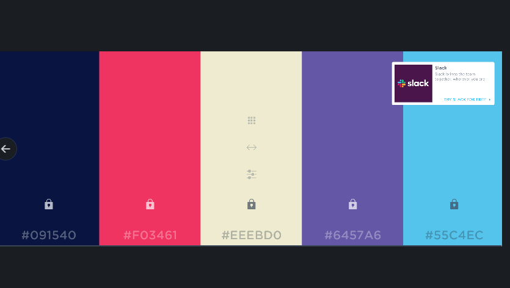
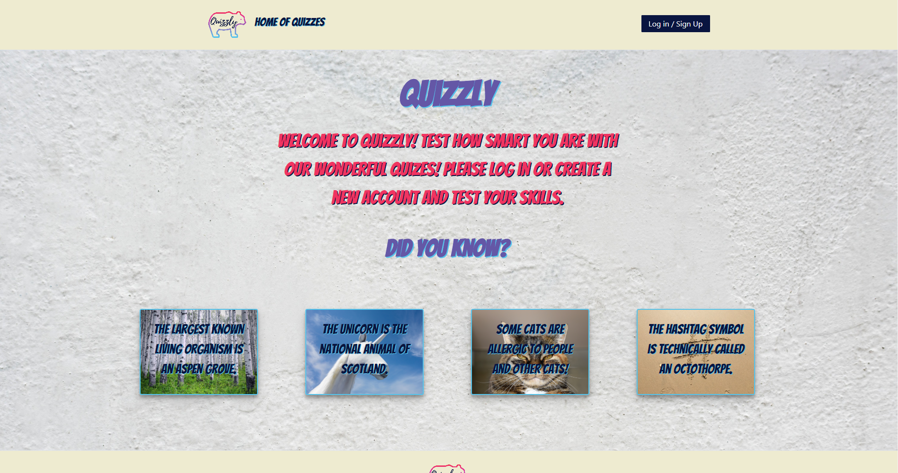
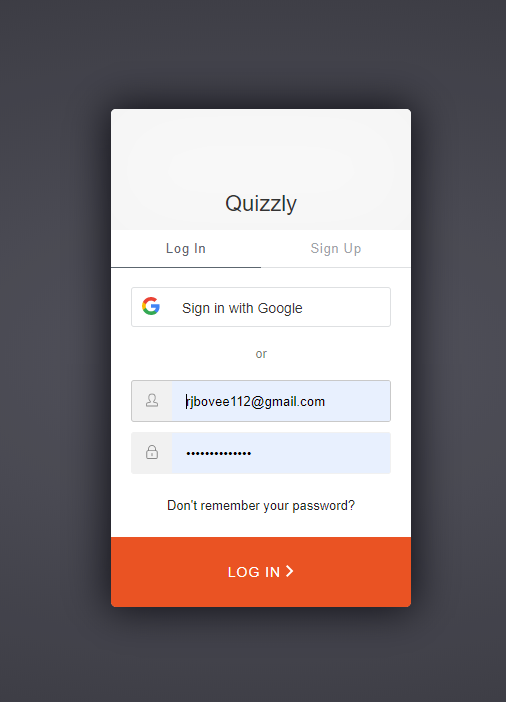
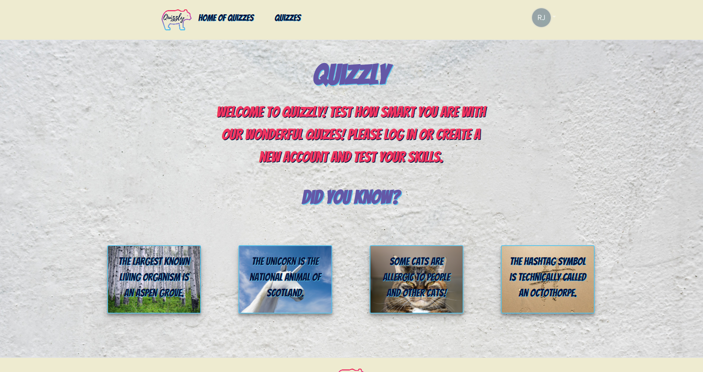
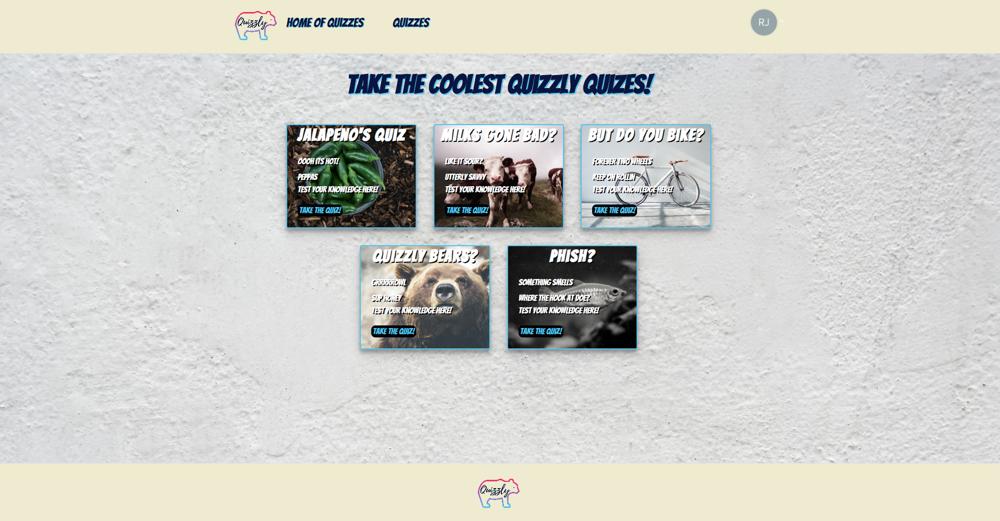
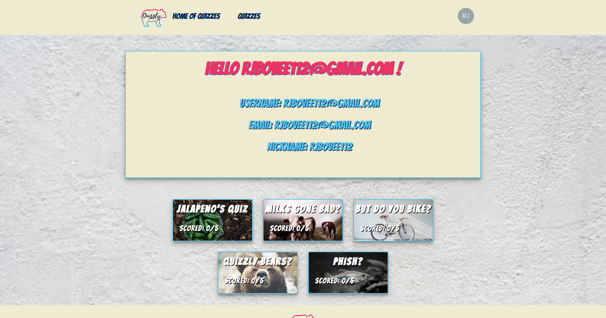

# Team Project 3

As the final project for the University of Utah Coding Bootcamp, our team was able to create whatever app that we wanted.  The requirements are it must be Full Stack MERN.  It had to use authentication to log into your account. We also had to use React as the framework for the entire project.

*****

# Quizzly

Our team created a quiz app called Quizzly.  As a user you can create a profile, take a quiz, and have your answers saved to the profile page.  The quizzes are all different types of fun activities.  We wanted to make a fun creative app that was colorful, creative, and responsive.  Quizzly can be viewed in desktop and mobile.  Enjoy the fun that we have created!

*****

## How to Use

The user is taken to the home page, where you can see some fun trivia questions.  In the top right corner, you can log in/create a new account.  Once you log in you now have access to the quizzes that we have.  Click on the take the quiz button and on which quiz you want to take.  You can then take the quiz by answering the questions.  Once the quiz is done, you can see your score.  You are also able to see your score on all the quizzes that you have take on the profile page.  

*****

## Design  

We wanted to create a fun and colorful design.  Our quizzes and cards are fulled with color and fun images.  It was fun to design an app that was colorful, fun, and creative.  You can see the color scheme that we used in the image below.

*****

### Landing Page

* This is the page that you will land on for our app!

### Log In 

* This is the log in pop-up.  People will use this to sign in or create a new account.

### Logged On Page

* You will see this page once you have logged on.

### Quiz Page

* The quiz page! There is where you can take all of our fun quizzes.

### Profile Page

* This is your profile page, you can see all the scores you took on your quizzes.

*****

## Problems 

React was awfully hard to integrate into all that we have learned in class.  Just adding CSS and HTML was a learning curve.  The design process was different for React compared to just creating a webpage.  Arranging everything took some time but once it was created and understood it was fun to try something new.  The other problem that we had was making everything mobile. Using authentication and auth 0 for the first time was also a very steep learning curve.  The back-end people had their time full of creating the correct code to connect everything together.  The quiz and the quiz answers showing the profile page was especially hard.  It was a hard learning curve for those working the front and the back end on this project, but we are proud of what we have accomplished.

*****

## Future Development 

We would like to add more quizzes on the future project.  We would also like to add topics, so you can choose which kind of quiz you would like to take.  For example, you could choose to take a pop-culture quiz, history quiz or a music quiz.  With these topics we would put them into the nav bar, and then have a drop down to a page that is filled with topic quiz.  

*****

## Created By

1. Robert Bovee - Frontend Design and Readme
2. Blaise Laurel - Backend, Auth 0 and authentication
3. Atravias Borley - Backend and quiz questions
4. Jordan Hanson - Backend

*****

## Links 

https://github.com/blaurel93/QuizProject

https://immense-shelf-50735.herokuapp.com/
